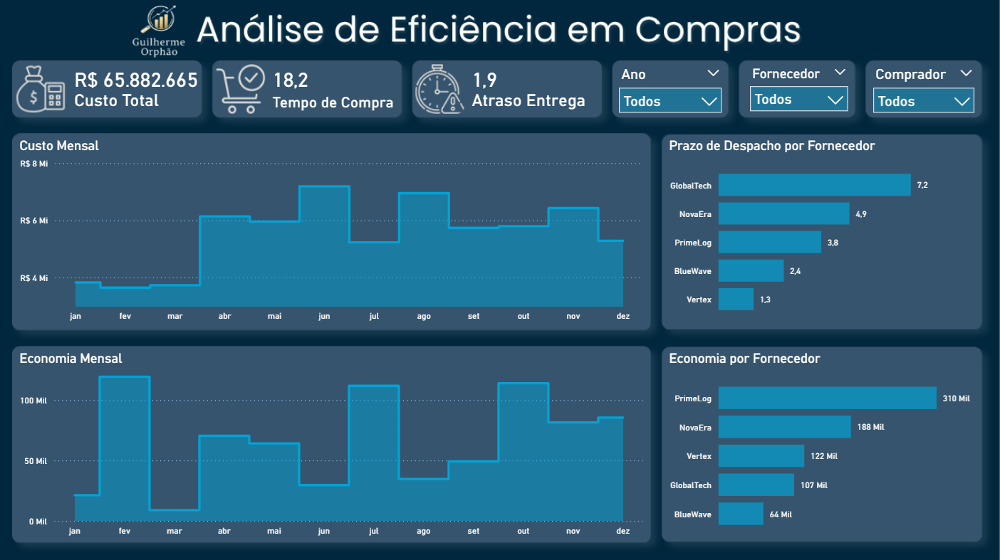
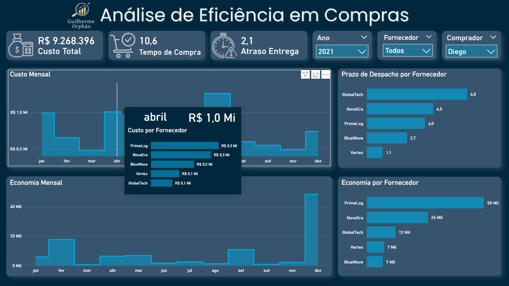

# Sales Efficiency Analysis

# Overview

This project was developed with the objective of analyzing purchasing efficiency and identifying strategic insights related to suppliers, buyers, materials and purchasing performance.

The analysis was built using a dimensional modeling approach (Star Schema), enabling efficient exploration of purchasing data and creation of interactive dashboards for business analysis.

---

# Objectives

The main objectives of this project are:

- Analyze purchasing performance
- Identify suppliers with higher purchasing volume
- Monitor purchasing trends over time
- Evaluate buyer performance
- Support strategic decision-making through data visualization

---

# Tools & Technologies

- Power BI
- Power Query
- DAX
- Excel
- Dimensional Modeling (Star Schema)

---

# Dataset Structure

The project uses a dimensional model composed of:

### Fact Table

- `fCompras`

### Dimension Tables

- `dFornecedor`
- `dComprador`
- `dMateriaPrima`
- `dCalendario`

This structure improves scalability, performance and analytical flexibility within the dashboard.

---

# Key Metrics & Analysis

The dashboard includes analyses such as:

- Total purchase value
- Purchase volume by supplier
- Purchase evolution over time
- Buyer performance
- Material purchase distribution
- KPI indicators for purchasing efficiency

---

# Dashboard Preview

## Main Dashboard



---

## Filters & Tooltip Interaction



---

# Business Insights

Some insights generated from the analysis include:

- Identification of suppliers with the highest purchasing concentration
- Seasonal purchasing behavior patterns
- Opportunities for purchasing optimization
- Comparison between buyer performances
- Analysis of purchasing distribution by material category

---

# Project Structure

```text
sales-efficiency-analysis
│
├── dashboard
│   └── dashboard.pbix
│
├── dataset
│   ├── fCompras.xlsx
│   ├── dFornecedor.xlsx
│   ├── dComprador.xlsx
│   ├── dMateriaPrima.xlsx
│   └── dCalendario.xlsx
│
├── images
│   ├── dashboard-overview.png
│   ├── dashboard-filters-tooltip.png
│   └── Tooltip.png
│
└── README.md
```

---

# Future Improvements

Possible future improvements for this project:

- Integration with larger datasets
- Advanced DAX measures
- Predictive purchasing analysis
- Supplier performance scoring
- Interactive drill-through pages

---

# Author

Guilherme Orphão

LinkedIn:
https://www.linkedin.com/in/guilhermeorphao/

GitHub:
https://github.com/GuilhermeOrphao

Email
[orphaopng@gmail.com]
